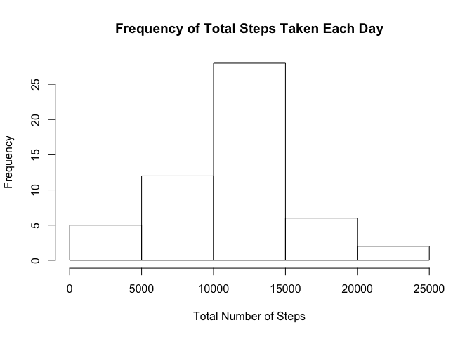
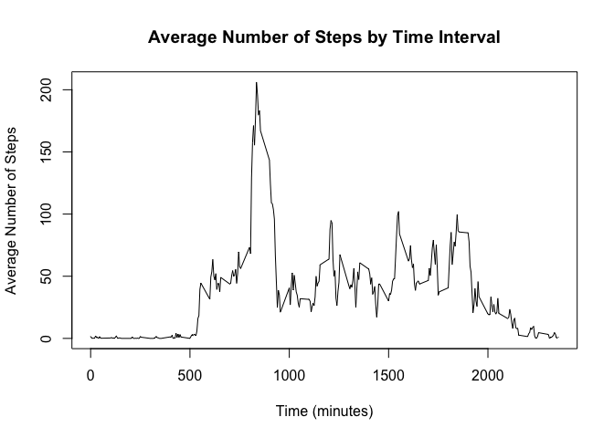
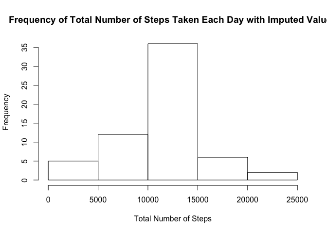
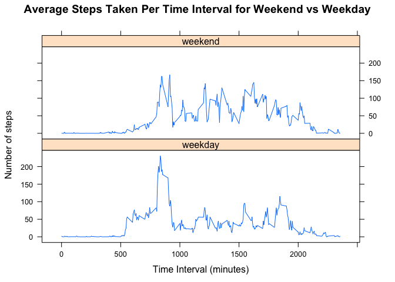

# Reproducible Research: Peer Assessment 1
#### *Queenie Chan*


  
## Loading and preprocessing the data

```r
stepDataFull <- read.csv(file = "activity.csv",header = T,sep = ",",stringsAsFactors=F)
stepData <- na.omit(stepDataFull)
```

  
## What is mean total number of steps taken per day?

**1. Calculate total number of steps taken per day**

```r
# step totals for each day:
totSteps_Day <- aggregate(steps ~ date, data = stepData,FUN = sum)
```

**2. Histogram of total steps per day**

```r
hist(totSteps_Day$steps, main="Frequency of Total Steps Taken Each Day", xlab="Total Number of Steps")
```

 

**3. Calculate mean and median of total steps taken per day**

```r
totSteps_mean <- mean(totSteps_Day$steps)
totSteps_med <- median(totSteps_Day$steps)
```
The mean of the total steps taken per day (without NA or imputed values) is 1.0766189\times 10^{4}.  
The median of the total steps taken per day (without NA or imputed values) is 10765.
  
## What is the average daily activity pattern?
**1. Time series plot of 5-minute interval and average number of steps taken, averaged across all days**

```r
# num steps for each interval avg'ed across all days:
avgSteps <- aggregate(steps ~ interval, data = stepData, FUN = mean)
plot(steps ~ interval, data = avgSteps,type = "l", main="Average Number of Steps by Time Interval",
     xlab = "time (minutes)", ylab="number of steps")
```

 

**2. 5-minute interval (on average across all days in dataset) containing max number of steps**

```r
avgSteps$interval[avgSteps$steps==(max(avgSteps$steps))]
```

```
## [1] 835
```
  
## Imputing missing values
**1. Calculate and report the total number of missing values (NAs) in the dataset**

```r
sum(is.na(stepDataFull))
```

```
## [1] 2304
```

**2. Fill in all missing values - using mean for 5 min interval.**
Because the NA values in the data are NA for the entire day, we will replace the step values for these dates (naDates) with the vector of average number of steps for each 5-min interval across all days, calculated in the previous section. 

**3. Creat a new dataset which is the original dataset with missing data filled in.**
First, we will identify the dates that have NA values. Then we will create the new dataset with imputed data for the days with NA values, based on the average number of steps for each interval.


```r
naDates <- unique(stepDataFull$date[which(is.na(stepDataFull$steps))])

stepsFullImputed <- stepDataFull

for (iDate in naDates){
    naData_i <- stepsFullImputed$steps[stepsFullImputed$date==iDate]
    stepsFullImputed$steps[stepsFullImputed$date==iDate] <- replace(naData_i, 
                                                                    is.na(naData_i), avgSteps$steps)
}
```


```r
sum(is.na(stepsFullImputed)) # checking number of NAs in the imputed dataset. Should be 0
```

```
## [1] 0
```

```r
summary(stepsFullImputed)
```

```
##      steps            date              interval     
##  Min.   :  0.00   Length:17568       Min.   :   0.0  
##  1st Qu.:  0.00   Class :character   1st Qu.: 588.8  
##  Median :  0.00   Mode  :character   Median :1177.5  
##  Mean   : 37.38                      Mean   :1177.5  
##  3rd Qu.: 27.00                      3rd Qu.:1766.2  
##  Max.   :806.00                      Max.   :2355.0
```

**4. Make a histogram of the total number of steps taken each day.**

```r
totSteps_Day_imputed <- aggregate(steps ~ date, data=stepsFullImputed,FUN = sum)
hist(totSteps_Day_imputed$steps, main="Frequency of Total Number of Steps Taken Each Day", 
     xlab="Total Number of Steps")
```

 

**Calculate the mean and median total number of steps taken per day. Do these values differ from the estimates from the first part of the assignment? What is the impact of imputing missing data on the estimates of the total daily number of steps?**

```r
totSteps_mean_imp <- mean(totSteps_Day_imputed$steps)
totSteps_med_imp <- median(totSteps_Day_imputed$steps)
```
The mean of the total steps taken per day *with* imputed imputed values is 1.0766189\times 10^{4}.  
The median of the total steps taken per day *with* imputed values is 1.0766189\times 10^{4}.  
(The mean and median of total steps without imputed values are 1.0766189\times 10^{4} and 10765, respectively).  
  
Since the missing data was imputed based on the average number of steps for each time interval across all days, the average was not affected, since the imputed values were using the same average and balanced out. The median, however, became closer to the average with the imputed values, since adding average values skews the data towards the average.

## Are there differences in activity patterns between weekdays and weekends?

**1. Create a new factor variable in the dataset with two levels – “weekday” and “weekend” indicating whether a given date is a weekday or weekend day.**


```r
stepsFullImputed_DoW <- stepsFullImputed
weekdays <- c("Monday","Tuesday","Wednesday","Thursday","Friday")

# Add column with Day of Week
stepsFullImputed_DoW$DoW <- weekdays(as.Date(stepsFullImputed_DoW$date))

# Replace Days of Week with weekend/weekday 
stepsFullImputed_DoW$DoWtype[stepsFullImputed_DoW$DoW %in% c("Saturday","Sunday")] <- "weekend"
stepsFullImputed_DoW$DoWtype[stepsFullImputed_DoW$DoW %in% weekdays] <- "weekday"
```

**2. Make a panel plot containing a time series plot of the 5-minute interval (x-axis) and the average number of steps taken, averaged across all weekday days or weekend days (y-axis).**

```r
avgStepsFullDoW <- aggregate(steps ~ interval+DoWtype, data=stepsFullImputed_DoW, FUN=mean)

# Plot with lattice package
library(lattice)
xyplot(steps ~ interval | DoWtype, data=avgStepsFullDoW, type = "l", layout=c(1,2), 
       xlab="Time Interval (minutes)",ylab="Number of steps",
       main="Average Steps Taken Per Time Interval for Weekend vs Weekday")
```

 
